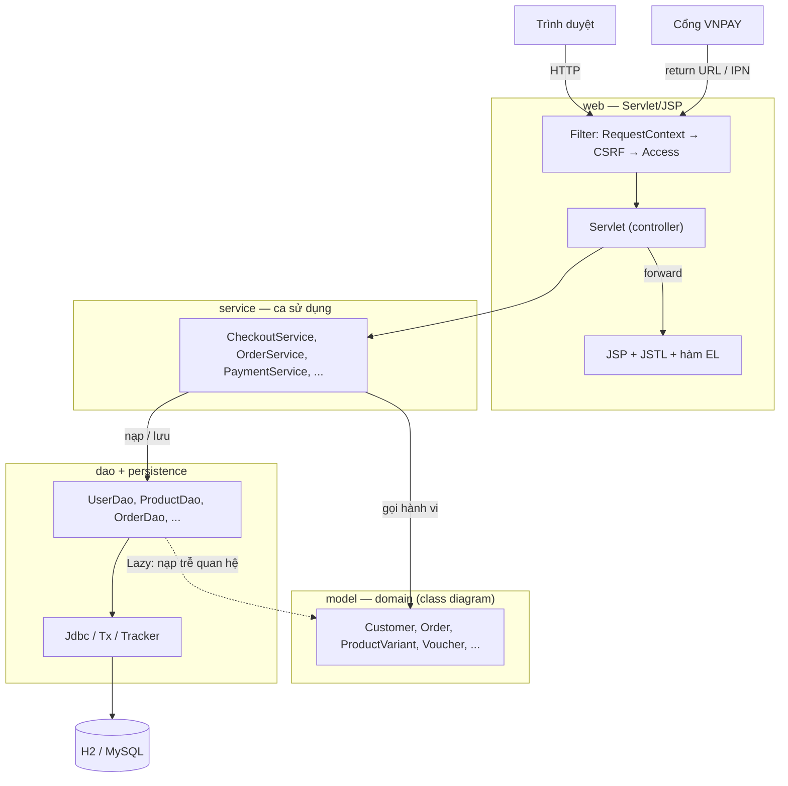

# 2. Kiến trúc

## Các tầng

| Tầng | Package | Trách nhiệm |
| --- | --- | --- |
| Domain | `com.shop.model.*` | Dữ liệu và **hành vi** theo class diagram; tự kiểm tra quy tắc nghiệp vụ, ném `DomainException` với thông điệp tiếng Việt hiển thị được cho người dùng. Không phụ thuộc JDBC hay Servlet. |
| Service | `com.shop.service` | Mỗi ca sử dụng là một transaction: nạp đối tượng → gọi hành vi domain → lưu. Không chứa quy tắc nghiệp vụ. |
| DAO | `com.shop.dao` | Ánh xạ bảng ↔ đối tượng; nạp theo lô; ghi bộ đếm bằng chênh lệch có điều kiện. |
| Persistence | `com.shop.persistence` | Pool HikariCP, kết nối theo luồng, transaction, tạo schema, dữ liệu mẫu. |
| Web | `com.shop.web` | Servlet đọc tham số, gọi service, chọn view; filter lo mã hoá, CSRF, phân quyền. |

## Vòng đời một request

1. **`RequestContextFilter`** (đầu tiên, cả `REQUEST` và `ERROR`): đặt UTF-8, gắn các thuộc tính dùng chung cho view
   (`now`, `auth`, `nav` — menu danh mục, số món trong giỏ/yêu thích, chỉ truy vấn khi JSP thật sự dùng), bắt và ghi
   log lỗi ngoài dự kiến, cuối cùng **trả kết nối CSDL của request về pool** (`Tx.release()`).
2. **`CsrfFilter`**: tạo token cho session; mọi `POST` phải gửi `_csrf` trùng token, nếu không trả 403.
3. **`AccessFilter`** (3 khai báo trong `web.xml` với tham số `require` = `customer` / `staff` / `admin`): chưa đăng
   nhập → chuyển tới `/login?next=...`; nạp lại `User` từ CSDL, tài khoản bị khoá thì đăng xuất ngay; sai vai trò → 403.
   Đối tượng `User` đã nạp được đặt vào request (`currentUser`) cho servlet dùng.
4. **Servlet** gọi service; lỗi nghiệp vụ (`DomainException`) được hiển thị lại trên form hoặc qua *flash message*
   rồi redirect (mẫu Post/Redirect/Get).
5. **JSP** hiển thị, escape mọi dữ liệu người dùng bằng `<c:out>` / `fn:escapeXml`.

Tài nguyên tĩnh (`/css`, `/js`, `/fonts`, `/images`, `/uploads`) đi thẳng, không mở kết nối CSDL.

## Transaction và kết nối

- `Tx.connection()` mở **một kết nối cho mỗi luồng/request** khi cần; ngoài transaction kết nối ở chế độ auto-commit.
- `Tx.inTransaction(work)` bật transaction, commit khi xong, rollback khi có ngoại lệ; lời gọi lồng nhau tham gia
  transaction bên ngoài.
- Kết nối sống tới hết request nên JSP vẫn nạp được các quan hệ nạp trễ (giống *open session in view*).
- Luồng nền (job tự huỷ đơn VNPAY quá hạn) dùng `Tx.withConnection(...)` để trả kết nối khi xong.

## Nạp trễ quan hệ (`Lazy`)

Domain giữ quan hệ qua `Lazy<T>`: DAO cung cấp cách nạp, domain chỉ thấy giá trị. Nhờ vậy
`Customer.getTotalSpent()`, `Customer.hasPurchased()`, `Product.getFinalPrice()`… viết thuần Java, không biết đến JDBC.

| Quan hệ | Nạp khi |
| --- | --- |
| `Customer` → sổ địa chỉ, giỏ hàng, yêu thích, đơn hàng | lần đầu gọi `getAddressBook()`, `getCart()`... |
| `Product` → biến thể, khuyến mãi | lần đầu truy cập, **theo lô** cho mọi sản phẩm nạp cùng nhau (1 truy vấn cho cả trang) |
| `Product` → đánh giá | lần đầu truy cập (trang chi tiết) |
| `Promotion` → sản phẩm | lần đầu truy cập |

## Chống ghi đè khi thao tác đồng thời

`Tracker` ghi nhớ trạng thái gốc lúc nạp của mỗi đối tượng (theo request). Khi lưu:

| Dữ liệu | Cách ghi | Bảo vệ |
| --- | --- | --- |
| Tồn kho, số đang giữ của biến thể | `stock = stock + Δ`, `reserved = reserved + Δ` | điều kiện `0 ≤ reserved + Δ ≤ stock + Δ`; không thoả → `DomainException` "vừa hết hàng" |
| Lượt dùng voucher | `used_count = used_count + Δ` | điều kiện `0 ≤ used_count + Δ ≤ usage_limit` |
| Trạng thái đơn | `UPDATE ... WHERE id = ? AND status = <trạng thái lúc nạp>` | 0 dòng → "đơn vừa được người khác cập nhật" |
| Trạng thái thanh toán | `UPDATE ... WHERE id = ? AND status = <trạng thái lúc nạp>` | callback VNPAY lặp lại không xử lý hai lần |

Kịch bản B của đặc tả (hai khách cùng mua chiếc áo cuối cùng) vì vậy đúng cả ở tầng CSDL, không chỉ trong bộ nhớ —
xem test `staleStockSnapshotCannotOversell`. Bảng `product_variants` và `vouchers` còn có ràng buộc `CHECK` tương ứng.

## Bảo mật

| Mối lo | Biện pháp | Vị trí |
| --- | --- | --- |
| Lộ mật khẩu | PBKDF2-HMAC-SHA256, 65.536 vòng, salt 16 byte ngẫu nhiên; so sánh thời gian hằng | `util/PasswordHasher` |
| Dò tên đăng nhập qua thời gian phản hồi | Băm giả khi tên không tồn tại | `AccountService.login` |
| Chiếm phiên (session fixation) | Huỷ session cũ, tạo session mới khi đăng nhập | `web/Auth.login` |
| CSRF | Token theo session cho mọi POST; đăng xuất chỉ qua POST | `CsrfFilter`, các form |
| XSS | Escape đầu ra JSP; không dùng scriptlet | JSP |
| SQL injection | Chỉ dùng `PreparedStatement` có tham số | `persistence/Jdbc` |
| Truy cập trái phép | Phân quyền theo khu vực URL; kiểm tra chủ sở hữu đơn trong service | `AccessFilter`, `OrderService`, `PaymentService` |
| Tài khoản bị khoá vẫn dùng session cũ | Nạp lại trạng thái `active` ở mỗi request vào khu vực cần đăng nhập | `AccessFilter` |
| Open redirect | Chỉ chấp nhận đường dẫn nội bộ cho `next` / Referer | `BaseServlet.safePath`, `Referer` |
| Tải lên tệp độc hại | Chỉ JPG/PNG/WEBP/GIF, kiểm tra chữ ký tệp, ≤ 2 MB, tên ngẫu nhiên, chặn path traversal khi phục vụ | `ImageStorage`, `UploadServlet` |
| Giả mạo kết quả thanh toán | Kiểm chữ ký HMAC-SHA512 và đối chiếu số tiền với lần thanh toán | `VnpayGateway.verify`, `PaymentService` |
| Cookie phiên | `HttpOnly`, chỉ theo dõi bằng cookie (không `jsessionid` trên URL), hết hạn 60 phút | `web.xml` |
