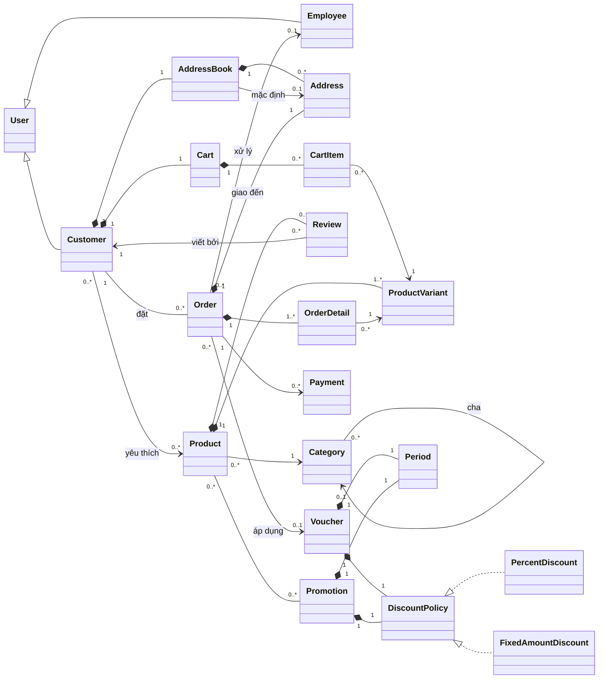
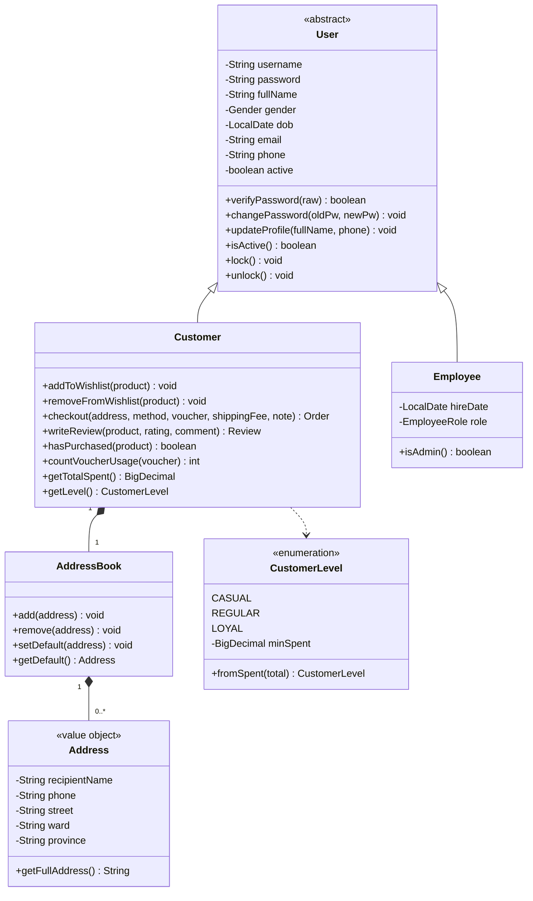
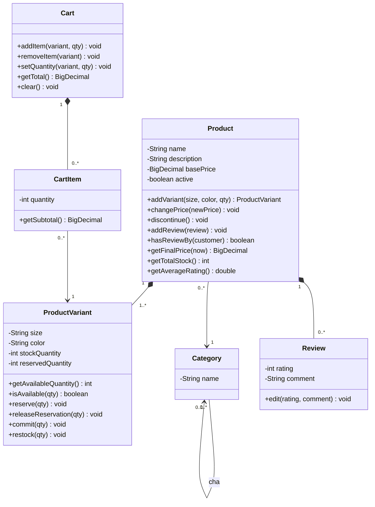
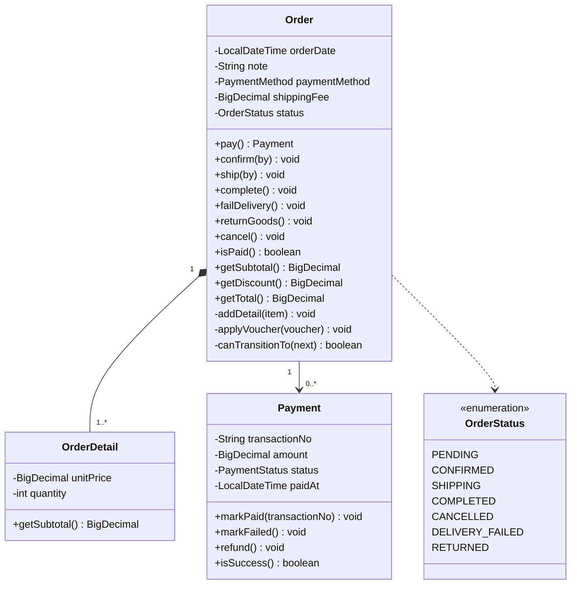
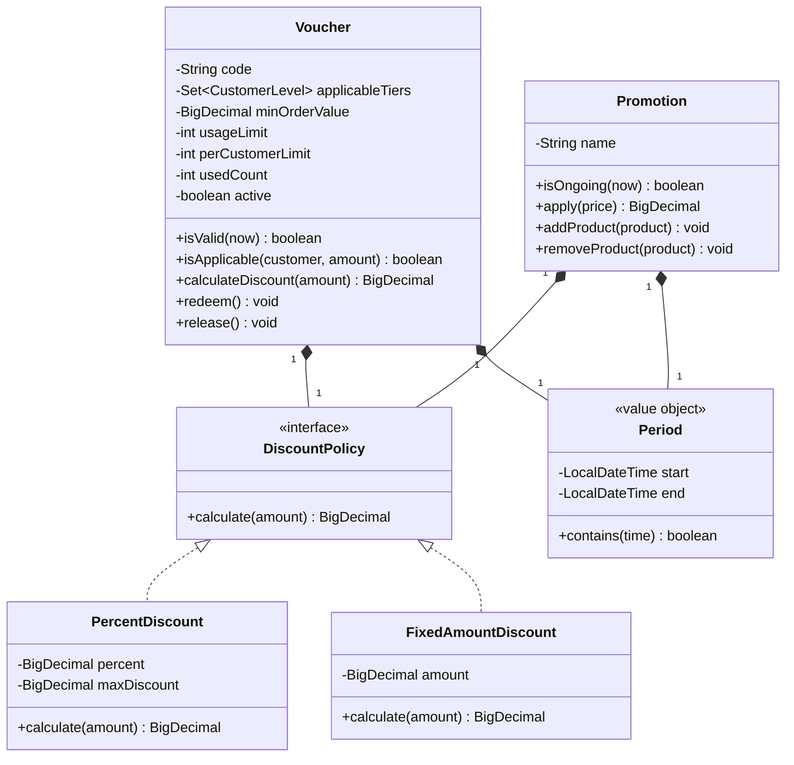

# 3. Mô hình lớp

Domain model cài đặt theo [class diagram v6](dac-ta/class-diagram-v6.drawio): 22 lớp/interface và 6 enum, chia đúng
4 package. Các sơ đồ dưới đây vẽ lại từ mã nguồn (chỉ ghi thuộc tính và phương thức có trên class diagram).

## Tổng thể các quan hệ

## Package Tài khoản — `com.shop.model.account`

## Package Sản phẩm & mua sắm — `com.shop.model.catalog`

## Package Đơn hàng & thanh toán — `com.shop.model.order`

## Package Giảm giá — `com.shop.model.discount`

## Ánh xạ lớp → mã nguồn

| Lớp | Tệp | Ghi chú cài đặt |
| --- | --- | --- |
| `User` (abstract) | `model/account/User.java` | Mật khẩu lưu dạng băm; `lock/unlock` đổi trạng thái của chính tài khoản |
| `Customer` | `model/account/Customer.java` | `checkout` tạo `Order` từ giỏ rồi `cart.clear()`; hạng = `CustomerLevel.fromSpent(getTotalSpent())` |
| `Employee` | `model/account/Employee.java` | `Employee.hire(...)` tạo tài khoản nhân viên |
| `AddressBook` | `model/account/AddressBook.java` | Giữ địa chỉ mặc định bằng liên kết riêng; xoá địa chỉ mặc định thì chọn địa chỉ còn lại đầu tiên |
| `Address` | `model/account/Address.java` | Value object: `equals` theo nội dung; `copy()` cho bản địa chỉ riêng của đơn |
| `CustomerLevel` | `model/account/CustomerLevel.java` | Ngưỡng: Thành viên 0 ₫, Thân thiết 2.000.000 ₫, VIP 10.000.000 ₫ |
| `Product` | `model/catalog/Product.java` | Giá cuối = mức giảm cao nhất trong các khuyến mãi đang chạy |
| `ProductVariant` | `model/catalog/ProductVariant.java` | Bất biến `0 ≤ reserved ≤ stock` giữ trong domain và ở CSDL |
| `Category` | `model/catalog/Category.java` | Cây cha – con, chặn vòng lặp khi đổi cha |
| `Cart`, `CartItem` | `model/catalog/Cart.java`, `CartItem.java` | Chỉ `Cart` sửa được số lượng dòng (`CartItem.setQuantity` là package-private) |
| `Review` | `model/catalog/Review.java` | Sao ngoài 1–5 bị từ chối ngay khi tạo/sửa |
| `Order` | `model/order/Order.java` | Bảng chuyển trạng thái trong `canTransitionTo`; tác động kho/voucher/tiền theo đặc tả |
| `OrderDetail` | `model/order/OrderDetail.java` | Giữ đơn giá đã chốt |
| `Payment` | `model/order/Payment.java` | Chỉ `Order.pay()` tạo được (constructor package-private) |
| `DiscountPolicy` & cài đặt | `model/discount/*.java` | Thêm kiểu giảm mới = thêm một lớp cài đặt (Open/Closed) |
| `Voucher`, `Promotion`, `Period` | `model/discount/*.java` | `Promotion` ↔ `Product` hai chiều qua `addProduct/removeProduct` |

## Bổ sung so với class diagram

Các phần dưới đây không có trên sơ đồ, được thêm vì nhu cầu cài đặt; không thay đổi ý nghĩa của mô hình.

| Lớp | Bổ sung | Lý do |
| --- | --- | --- |
| Mọi thực thể | `id` (lớp gốc `Entity`), `Lazy<T>` cho quan hệ | Định danh lưu trữ và nạp trễ — chi tiết của tầng lưu trữ |
| `Customer.checkout` | Thêm tham số `shippingFee`, `note` | `Order` có hai thuộc tính này; phí lấy theo báo giá vận chuyển |
| `Product` | `imageUrl`, `updateInfo(...)`, `isOnSale`, `getTotalAvailable`, `findVariant`, `getSizes/getColors` | Hiển thị ảnh, sửa thông tin sản phẩm, giao diện chọn size/màu |
| `Product` | `joinPromotion/leavePromotion` | Giữ quan hệ hai chiều nhất quán khi `Promotion.addProduct/removeProduct` |
| `Category` | `rename`, `moveTo`, `isWithin`, `getFullName` | Quản trị danh mục, lọc theo cả cây danh mục con |
| `Voucher` | `create(...)`, `whyNotUsable(...)`, `activate/deactivate` | Kiểm tra dữ liệu khi tạo; báo cho khách lý do không dùng được mã; bật/tắt mã |
| `Promotion` | `create(...)`, `rename`, `includes` | Quản trị chương trình |
| `Order` | `canConfirm/canShip/...`, `isPaymentOverdue`, `holdsVoucherUsage`, `contains`, `isRefunded`, `findPayment` | Hiện đúng nút thao tác; tự huỷ đơn VNPAY quá hạn; đếm lượt voucher; kiểm tra đã mua |
| `Payment`, `Review` | `createdAt` (và `updatedAt` cho Review) | Hiển thị lịch sử |
| `AddressBook` | `findById`, `isDefault`, tối đa 10 địa chỉ | Thao tác theo bản ghi trên giao diện |
| `Cart` | `getItemCount`, `find`, tối đa 99 cái/dòng | Biểu tượng giỏ hàng, chặn số lượng bất thường |
| Các enum | `getLabel()` (nhãn tiếng Việt), `OrderStatus/PaymentStatus.getBadge()` | Hiển thị |
