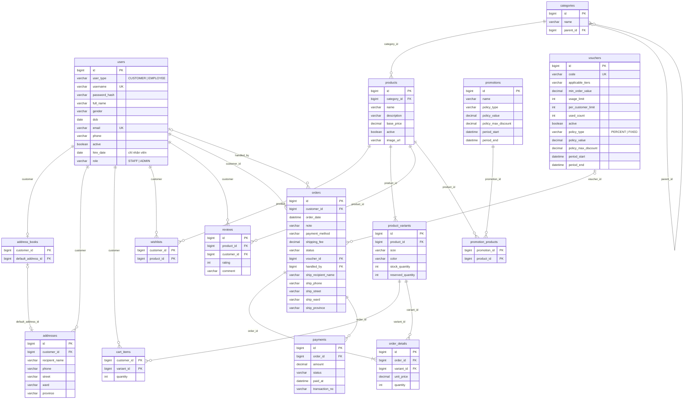

# 4. Cơ sở dữ liệu

Lược đồ nằm ở [`src/main/resources/db/schema.sql`](../src/main/resources/db/schema.sql), viết bằng cú pháp chung chạy
được trên **MySQL 8** và **H2 (chế độ MySQL)**. Ứng dụng tự chạy script này khi khởi động (`CREATE TABLE IF NOT EXISTS`).

## Sơ đồ ERD

## Ánh xạ từ class diagram

| Khái niệm trên sơ đồ | Cách lưu | Lý do |
| --- | --- | --- |
| Kế thừa `User` ← `Customer`, `Employee` | **Một bảng** `users` + cột phân loại `user_type`; `hire_date`, `role` để trống với khách | Customer không có thuộc tính riêng; truy vấn đăng nhập chỉ cần một bảng |
| `AddressBook` (không thuộc tính) | Bảng `address_books` chỉ giữ liên kết `default_address_id` | Đặc tả: địa chỉ mặc định là một **liên kết riêng**, không phải cờ trên từng địa chỉ |
| `Address` value object trong sổ | Bảng `addresses` (id chỉ để thao tác trên giao diện) | Sổ chứa 0..* địa chỉ |
| `Order ◆ Address «giao đến»` | **Nhúng** vào `orders` thành các cột `ship_*` | Đơn giữ bản địa chỉ của riêng nó; khách sửa/xoá sổ không ảnh hưởng đơn cũ |
| `Cart ◆ CartItem`, `Customer ◆ Cart` (1–1) | Bảng `cart_items` khoá chính `(customer_id, variant_id)` | Giỏ không có thuộc tính; mỗi biến thể chỉ một dòng (cộng dồn số lượng) |
| `Customer → Product «yêu thích»` (n–n) | Bảng nối `wishlists` | Không cần lớp riêng |
| `Product – Promotion` (n–n, hai chiều) | Bảng nối `promotion_products` | |
| `Voucher/Promotion ◆ DiscountPolicy`, `◆ Period` (1–1) | **Nhúng** thành cột `policy_*`, `period_*` | Composition 1–1, không dùng lại giữa các bản ghi |
| `Voucher.applicableTiers: Set<CustomerLevel>` | Chuỗi `applicable_tiers`, ví dụ `REGULAR,LOYAL` | Tập nhỏ, cố định |
| Enum (`OrderStatus`, `PaymentMethod`...) | `VARCHAR` lưu tên hằng | Dễ đọc, an toàn khi thêm hằng mới |
| Giá trị tính được | **Không lưu**: tạm tính, giảm giá, tổng tiền, hạng khách, điểm trung bình, giá bán cuối | Đặc tả: "những gì tính được từ quan hệ được thể hiện bằng phương thức" |

## Ràng buộc quan trọng

| Bảng | Ràng buộc | Ý nghĩa |
| --- | --- | --- |
| `product_variants` | `UNIQUE (product_id, size, color)`, `CHECK (reserved_quantity >= 0 AND reserved_quantity <= stock_quantity)` | Một cặp size + màu chỉ một biến thể; không giữ quá số hàng thật |
| `reviews` | `UNIQUE (product_id, customer_id)`, `CHECK (rating BETWEEN 1 AND 5)` | Mỗi khách tối đa một đánh giá cho một sản phẩm |
| `vouchers` | `UNIQUE (code)`, `CHECK (used_count >= 0 AND used_count <= usage_limit)` | Không dùng quá tổng lượt |
| `cart_items`, `order_details` | `CHECK (quantity > 0)` | |
| `users` | `UNIQUE (username)`, `UNIQUE (email)` | |
| `payments` | khoá ngoại tới `orders`, **không** `ON DELETE CASCADE` | Thanh toán được giữ để đối soát kể cả khi đơn bị huỷ |
| `addresses` | không có bảng nào khác tham chiếu tới (ngoài `address_books`) | Xoá địa chỉ khỏi sổ không ảnh hưởng đơn hàng |

Ghi chú: MySQL chỉ thực thi `CHECK` từ bản 8.0.16; ứng dụng vẫn tự bảo vệ bằng câu `UPDATE` có điều kiện
(xem [Kiến trúc — chống ghi đè đồng thời](02-kien-truc.md#chống-ghi-đè-khi-thao-tác-đồng-thời)).
