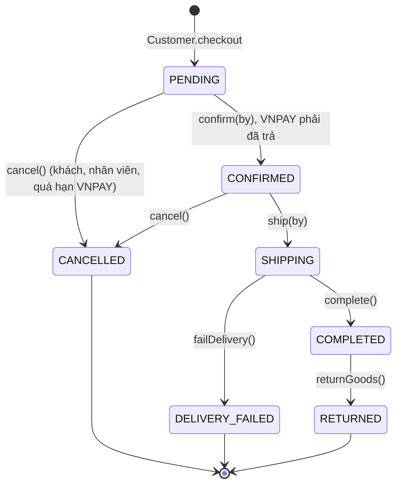
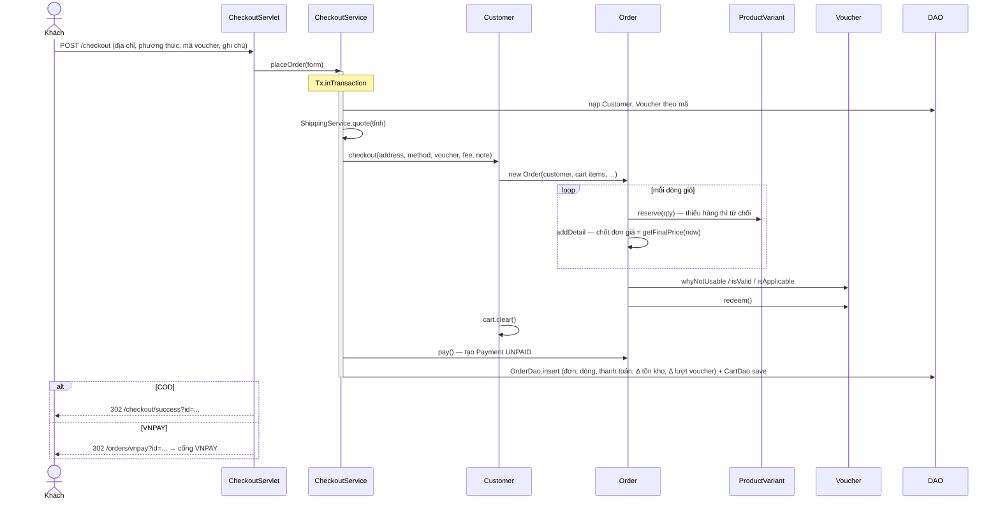
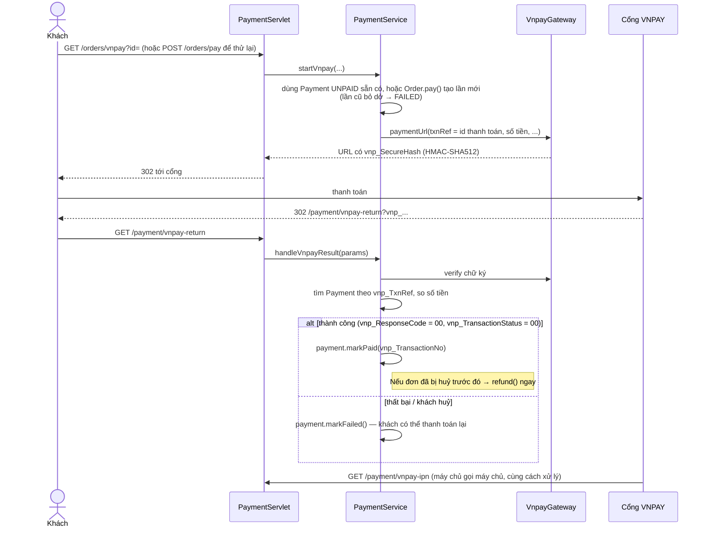

# 6. Luồng nghiệp vụ

## Vòng đời đơn hàng

Trạng thái chỉ đổi qua các hành động của `Order`; mỗi hành động tự kiểm tra trạng thái hiện tại
(`Order.canTransitionTo`). Đơn chỉ tiến theo một chiều.

| Hành động | Chuyển trạng thái | Kho | Voucher | Tiền |
| --- | --- | --- | --- | --- |
| `confirm(by)` | PENDING → CONFIRMED | `commit`: trừ hẳn hàng đang giữ | — | VNPAY phải `isPaid()` |
| `ship(by)` | CONFIRMED → SHIPPING | — | — | — |
| `complete()` | SHIPPING → COMPLETED | — | — | COD: lần thanh toán chuyển PAID (mã `COD-<id đơn>`) |
| `failDelivery()` | SHIPPING → DELIVERY_FAILED | `restock` | `release` | Hoàn tiền lần đã trả |
| `returnGoods()` | COMPLETED → RETURNED | `restock` | — | Hoàn tiền |
| `cancel()` khi PENDING | PENDING → CANCELLED | `releaseReservation` | `release` | Hoàn tiền nếu đã trả |
| `cancel()` khi CONFIRMED | CONFIRMED → CANCELLED | `restock` | `release` | Hoàn tiền nếu đã trả |

Người thực hiện: khách tự huỷ đơn của mình (`/orders/cancel`); nhân viên thực hiện mọi hành động
(`/staff/orders/action`); job nền huỷ đơn VNPAY quá hạn. `confirm` và `ship` ghi lại nhân viên xử lý (`handledBy`).

## Đặt hàng

Nếu bất kỳ bước nào ném `DomainException` (hết hàng, voucher không hợp lệ, địa chỉ sai…) thì transaction rollback,
không có gì được ghi, form thanh toán hiện lại kèm thông báo.

## Thanh toán VNPAY

- Xử lý **lặp lại an toàn**: return URL và IPN có thể cùng tới; lần thứ hai trả "đã xử lý trước đó".
- **Quá hạn:** mỗi phút, job `vnpay-expiry` huỷ các đơn VNPAY còn PENDING, chưa có lần thanh toán PAID và đặt quá
  `order.vnpayTimeoutMinutes` phút (mặc định 15) — nhả hàng đang giữ và trả lượt voucher.
- **Chế độ mock:** URL thanh toán trỏ về `/payment/mock-vnpay` trong chính ứng dụng; trang này kiểm chữ ký yêu cầu,
  cho chọn "thành công" (`00/00`) hoặc "huỷ" (`24/02`) rồi chuyển về return URL với tham số có chữ ký như VNPAY thật.

## Các kịch bản trong đặc tả

| Kịch bản | Diễn ra trong ứng dụng | Test tự động |
| --- | --- | --- |
| **A** — Mua áo, trả bằng VNPAY, dùng voucher | Thêm 2 áo vào giỏ (dữ liệu mẫu: Đen – M đang hết hàng đúng như bảng ví dụ của đặc tả, nên chọn Đen – L) → thanh toán chọn địa chỉ, VNPAY, mã `SALE10` → cổng VNPAY → nhân viên xác nhận, giao, hoàn tất → tổng chi tiêu và hạng của khách tăng | `OrderLifecycleTest.scenarioA_vnpayWithVoucher` |
| **B** — Hai khách cùng mua chiếc áo cuối | Người đặt sau nhận "chỉ còn 0 / vừa hết hàng"; khách thứ nhất huỷ thì áo bán được lại | `ProductVariantTest.scenarioB_twoCustomersCannotBuyTheLastShirt`, `PersistenceIntegrationTest.staleStockSnapshotCannotOversell` |
| **C** — Khách huỷ đơn COD đã xác nhận | Nút "Huỷ đơn" ở chi tiết đơn → hàng nhập lại kho, trả lượt voucher, không hoàn tiền vì chưa thu | `OrderLifecycleTest.scenarioC_cancelConfirmedCodOrder` |
| **D** — Khách COD từ chối nhận hàng | Nhân viên bấm "Giao thất bại" → nhập lại kho, trả lượt voucher, thanh toán vẫn UNPAID | `OrderLifecycleTest.scenarioD_codCustomerRefusesDelivery` |
| **E** — Viết đánh giá | Form đánh giá chỉ hiện khi khách có đơn COMPLETED chứa sản phẩm; lần sau là form sửa | `CustomerTest.scenarioE_onlyBuyersCanReviewOnce` |

## Các quy tắc khác

| Quy tắc | Nơi kiểm tra |
| --- | --- |
| Giá trong giỏ luôn theo giá hiện tại; chỉ chốt khi đặt hàng | `CartItem.getSubtotal`, `Order.addDetail` |
| Nhiều khuyến mãi chồng nhau → lấy mức giảm cao nhất | `Product.getFinalPrice` |
| Voucher: đang bật, trong thời hạn, còn lượt, đúng hạng khách, đủ giá trị tối thiểu, khách chưa dùng quá số lượt | `Voucher.isValid`, `isApplicable`, `whyNotUsable` |
| Lượt voucher của khách không tính đơn đã huỷ / giao thất bại | `Order.holdsVoucherUsage`, `Customer.countVoucherUsage` |
| Tổng chi tiêu = tổng tiền các đơn **hoàn tất**; hạng: Thành viên < 2 triệu ≤ Thân thiết < 10 triệu ≤ VIP | `Customer.getTotalSpent`, `CustomerLevel.fromSpent` |
| Phí vận chuyển: Hà Nội, TP.HCM 25.000 ₫; Hải Phòng, Đà Nẵng, Huế, Cần Thơ 30.000 ₫; tỉnh khác 35.000 ₫ | `ShippingService` |
| Tổng phải trả = tạm tính − giảm giá + phí vận chuyển | `Order.getTotal` |
| Sản phẩm ngừng bán không thêm vào giỏ / đặt được nhưng đơn cũ vẫn giữ | `Cart.addItem`, `Order.addDetail`, `Product.discontinue` |
