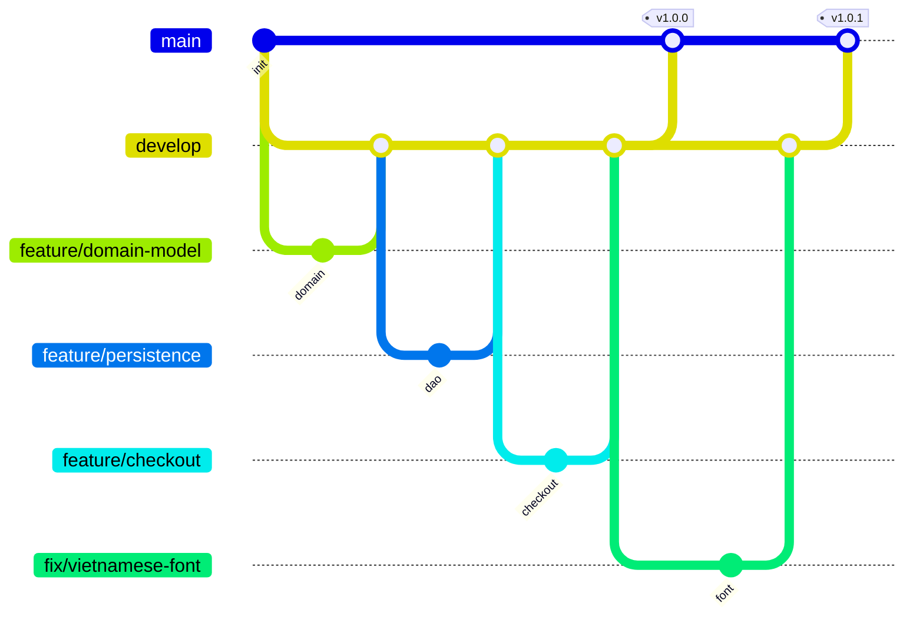

# 10. Quy trình Git

## Mô hình nhánh



| Nhánh | Vai trò |
| --- | --- |
| `main` | Bản phát hành, mỗi lần phát hành gắn tag `vX.Y.Z` |
| `develop` | Nhánh tích hợp; mọi nhánh con tách ra từ đây và merge lại vào đây |
| `feature/<tên>` | Một chức năng |
| `fix/<tên>` | Sửa lỗi |
| `docs/<tên>` | Tài liệu |

Quy tắc: không commit thẳng lên `main`/`develop`; merge bằng `git merge --no-ff` để lịch sử giữ rõ từng nhánh;
khi phát hành thì merge `develop` vào `main` và gắn tag.

## Các nhánh đã có

| Nhánh | Nội dung |
| --- | --- |
| `feature/domain-model` | Lớp gốc, enum, value object, các thực thể theo class diagram, test kịch bản A–E |
| `feature/persistence` | Cấu hình, schema, pool + transaction, DAO, dữ liệu mẫu, test tích hợp |
| `feature/web-foundation` | Tài nguyên template, filter (UTF-8, CSRF, phân quyền), layout JSP, trang chủ |
| `feature/auth` | Đăng ký, đăng nhập, đăng xuất, hồ sơ, đổi mật khẩu |
| `feature/address-book` | Sổ địa chỉ, 34 tỉnh/thành |
| `feature/catalog` | Cửa hàng (lọc, sắp xếp, phân trang), chi tiết sản phẩm, trang khuyến mãi |
| `feature/cart` | Giỏ hàng |
| `feature/wishlist` | Danh sách yêu thích |
| `feature/checkout` | Phí vận chuyển, đặt hàng, trang cảm ơn |
| `feature/customer-orders` | Lịch sử, chi tiết, huỷ đơn |
| `feature/vnpay-payment` | VNPAY, cổng giả lập, tự huỷ đơn quá hạn |
| `feature/reviews` | Đánh giá sản phẩm |
| `feature/staff-orders` | Khu nhân viên: tổng quan, xử lý đơn |
| `feature/admin-catalog` | Quản trị danh mục, sản phẩm, ảnh, biến thể, nhập kho |
| `feature/admin-discounts` | Quản trị khuyến mãi, voucher |
| `feature/admin-users` | Quản trị tài khoản |
| `feature/docker` | Cấu hình qua biến môi trường `SHOP_*`, Dockerfile, Docker Compose (H2 / MySQL) |
| `fix/refund-status-badge` | Hiện "Đã hoàn tiền" cho đơn đã hoàn tiền |
| `fix/vietnamese-font` | Thay font thiếu dấu tiếng Việt |
| `fix/empty-address-book-npe` | Lỗi trang thanh toán với khách chưa có địa chỉ |
| `docs/readme`, `docs/port-and-troubleshooting`, `docs/project-docs` | Tài liệu |

## Quy ước commit

Theo [Conventional Commits](https://www.conventionalcommits.org/): `<loại>(<phạm vi>): <mô tả>`.

| Loại | Dùng khi | Ví dụ |
| --- | --- | --- |
| `feat` | Thêm chức năng | `feat(cart): cart page with live prices, stock warnings and checkout gate` |
| `fix` | Sửa lỗi | `fix(persistence): NPE on checkout/address book for customers without a default address` |
| `test` | Thêm/sửa test | `test(domain): order lifecycle scenarios A, C, D and review scenario E` |
| `docs` | Tài liệu | `docs: README with run/deploy instructions...` |
| `build` | Đóng gói, Docker | `build(docker): optional MySQL 8.4 stack (docker-compose.mysql.yml)` |
| `chore` | Cấu hình, dọn dẹp | `chore: normalize line endings with .gitattributes` |

Mỗi commit là một bước nhỏ, biên dịch được và (nếu có test) chạy test pass.

## Phiên bản

| Tag | Nội dung |
| --- | --- |
| `v1.0.0` | Đầy đủ chức năng theo đặc tả và class diagram v6 |
| `v1.0.1` | Sửa font tiếng Việt |
| `v1.0.2` | Sửa lỗi trang thanh toán với khách chưa có địa chỉ |
| `v1.1.0` | Triển khai bằng Docker |

## Lệnh thường dùng

```bash
git checkout develop && git pull
git checkout -b feature/ten-chuc-nang
# ... sửa code, commit nhiều lần ...
git push -u origin feature/ten-chuc-nang
git checkout develop
git merge --no-ff feature/ten-chuc-nang
git push origin develop
```
