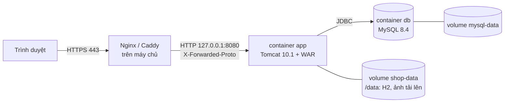

# 11. Triển khai bằng Docker

Ứng dụng đóng gói thành một image chạy **Tomcat 10.1 + Java 21**. Máy chủ chỉ cần cài Docker, không cần JDK,
Maven hay Tomcat.

| Tệp | Vai trò |
| --- | --- |
| `Dockerfile` | Build 2 giai đoạn: Maven build WAR (có chạy test) → Tomcat chạy WAR ở `/` |
| `.dockerignore` | Chỉ gửi `pom.xml` và `src/` vào quá trình build |
| `docker-compose.yml` | Chạy ứng dụng với H2 nhúng, dữ liệu trong volume `shop-data` |
| `docker-compose.mysql.yml` | File bổ sung: thêm MySQL 8.4 và chuyển ứng dụng sang MySQL |
| `.env.example` | Mẫu biến cấu hình — chép thành `.env` (đã `.gitignore`) |



## Chạy nhanh (H2)

```bash
docker compose up -d --build
```

Mở http://localhost:8080 (tài khoản mẫu như ở [README](../README.md#chạy-nhanh)). Lần build đầu mất vài phút vì
tải thư viện Maven và chạy bộ test; muốn bỏ qua test:

```bash
docker compose build --build-arg SKIP_TESTS=true
```

Các lệnh thường dùng:

| Việc | Lệnh |
| --- | --- |
| Xem log | `docker compose logs -f app` |
| Trạng thái (cột *STATUS* có `healthy` khi trang chủ phản hồi) | `docker compose ps` |
| Dừng (giữ dữ liệu) | `docker compose down` |
| Dừng và **xoá toàn bộ dữ liệu** (về lại dữ liệu mẫu) | `docker compose down -v` |
| Cập nhật lên mã mới | `git pull` rồi `docker compose up -d --build` |

Không dùng Compose:

```bash
docker build -t clothing-shop .
docker run -d --name shop -p 8080:8080 -v shop-data:/data clothing-shop
```

## Cấu hình bằng biến môi trường

Mọi khoá trong `app.properties` ghi đè được bằng biến `SHOP_<KHOÁ>`: viết hoa, dấu chấm thành gạch dưới
(`db.url` → `SHOP_DB_URL`, `db.poolSize` → `SHOP_DB_POOLSIZE`, `vnpay.hashSecret` → `SHOP_VNPAY_HASHSECRET`).
Thứ tự ưu tiên xem [mục 7](07-cau-hinh-va-trien-khai.md#các-khoá-cấu-hình).

Với Compose, đặt giá trị trong `.env`:

```bash
cp .env.example .env
```

| Biến | Mặc định | Ý nghĩa |
| --- | --- | --- |
| `APP_PORT` | `8080` | Cổng trên máy chủ |
| `APP_BIND` | `0.0.0.0` | Địa chỉ mở cổng; đặt `127.0.0.1` khi đã có reverse proxy để cổng 8080 không lộ ra Internet |
| `SHOP_DB_SEED` | `true` | Tạo dữ liệu mẫu khi CSDL trống |
| `SHOP_ORDER_VNPAYTIMEOUTMINUTES` | `15` | Hạn thanh toán đơn VNPAY |
| `SHOP_VNPAY_MODE` / `SHOP_VNPAY_TMNCODE` / `SHOP_VNPAY_HASHSECRET` | `mock` / `DEMOSHOP` / chuỗi demo | Cổng VNPAY |
| `MYSQL_PASSWORD`, `MYSQL_ROOT_PASSWORD` | (bắt buộc khi dùng MySQL) | Mật khẩu MySQL |

Image đã đặt sẵn: `SHOP_DB_URL` trỏ tới `/data/db/shop` (H2), `SHOP_UPLOAD_DIR=/data/uploads`,
`TZ=Asia/Ho_Chi_Minh`, `JAVA_OPTS=-XX:MaxRAMPercentage=75` (JVM dùng tối đa 75% RAM cấp cho container).
Muốn thêm biến khác thì thêm vào mục `environment:` của service `app` trong `docker-compose.yml`.

## Dùng MySQL

1. Đặt `MYSQL_PASSWORD` và `MYSQL_ROOT_PASSWORD` trong `.env` (để trống thì Compose báo lỗi và không chạy).
2. Chạy kèm file bổ sung:

   ```bash
   docker compose -f docker-compose.yml -f docker-compose.mysql.yml up -d --build
   ```

Container `db` tạo database `clothing_shop` (utf8mb4) và user `shop`; `app` chỉ khởi động khi MySQL đã sẵn sàng
(healthcheck), sau đó tự tạo bảng và dữ liệu mẫu. Mọi lệnh `docker compose ...` sau đó cũng phải kèm hai tham số
`-f` như trên. Ảnh tải lên vẫn nằm ở volume `shop-data`.

Cấu hình này đã chạy thử với toàn bộ kịch bản kiểm thử giao diện (đăng ký, giỏ hàng, đặt hàng, VNPAY giả lập, xử lý
đơn, quản trị) và job tự huỷ đơn VNPAY quá hạn.

## Đưa lên máy chủ (VPS)

1. Cài Docker Engine và plugin Compose (Ubuntu: theo hướng dẫn tại docs.docker.com/engine/install/ubuntu).
2. Lấy mã nguồn và tạo `.env`:

   ```bash
   git clone https://github.com/update-source/clothing-shop-servlet.git
   cd clothing-shop-servlet
   cp .env.example .env
   ```

3. Sửa `.env`: đặt `APP_BIND=127.0.0.1` (nếu dùng reverse proxy ở bước 5), mật khẩu MySQL, khoá VNPAY nếu có.
4. Chạy (H2 hoặc MySQL như ở trên). `restart: unless-stopped` giúp container tự chạy lại khi máy chủ khởi động lại.
5. Đặt một reverse proxy có HTTPS phía trước (bắt buộc nếu dùng VNPAY sandbox/thật vì return URL nên là `https`).

**Caddy** (tự xin chứng chỉ Let's Encrypt) — `/etc/caddy/Caddyfile`:

```
shop.example.com {
    reverse_proxy 127.0.0.1:8080
}
```

**Nginx** (chứng chỉ lấy bằng certbot):

```nginx
server {
    listen 443 ssl;
    server_name shop.example.com;
    # ssl_certificate ... ; ssl_certificate_key ... ;   (certbot --nginx tự thêm)

    client_max_body_size 5m;   # ảnh sản phẩm tối đa 2 MB

    location / {
        proxy_pass http://127.0.0.1:8080;
        proxy_set_header Host $host;
        proxy_set_header X-Forwarded-Proto $scheme;
        proxy_set_header X-Forwarded-For $proxy_add_x_forwarded_for;
    }
}
```

Tomcat trong image đã bật `RemoteIpValve`: với request đi qua proxy (địa chỉ nội bộ), ứng dụng đọc
`X-Forwarded-Proto` và `X-Forwarded-For` nên return URL VNPAY thành `https://shop.example.com/payment/vnpay-return`,
cookie phiên có cờ `Secure`, IP gửi sang VNPAY là IP thật của khách.

**Bảo mật khi chạy thật:**
- Tài khoản mẫu `admin/admin123`, `staff/staff123`, `khachhang/123456` có mật khẩu công khai — đặt
  `SHOP_DB_SEED=false` **trước lần chạy đầu** rồi tạo tài khoản quản trị riêng, hoặc đổi ngay mật khẩu các tài khoản
  mẫu sau khi chạy.
- Không commit `.env`; dùng mật khẩu MySQL mạnh. Cổng MySQL không được mở ra ngoài (Compose không publish cổng 3306).

## Sao lưu và khôi phục

Dữ liệu nằm trong các volume của Docker; tên đầy đủ có tiền tố tên project `clothing-shop_`.

```bash
# H2 + ảnh: dừng app để file H2 không đang được ghi, nén volume shop-data
docker compose stop app
docker run --rm -v clothing-shop_shop-data:/data -v "$PWD":/backup alpine tar czf /backup/shop-data.tgz -C /data .
docker compose start app

# MySQL
docker compose -f docker-compose.yml -f docker-compose.mysql.yml exec -T db \
    sh -c 'mysqldump -u root -p"$MYSQL_ROOT_PASSWORD" clothing_shop' > clothing_shop.sql
```

Khôi phục: giải nén `shop-data.tgz` vào volume (`tar xzf` với lệnh `docker run` tương tự), nạp `clothing_shop.sql`
bằng `mysql` trong container `db`.

## Xử lý sự cố

| Hiện tượng | Nguyên nhân / cách xử lý |
| --- | --- |
| `failed to connect to the docker API ... dockerDesktopLinuxEngine` | Docker Desktop chưa chạy — mở Docker Desktop, đợi biểu tượng báo *Engine running*. |
| `port is already allocated` / `ports are not available` | Cổng 8080 đang bận. Đặt `APP_PORT=8081` trong `.env`. |
| Mở http://localhost:8080 nhưng thấy bản chạy bằng `mvn jetty:run` chứ không phải container | Trên Windows, Jetty (nghe `127.0.0.1:8080`) và container (nghe `0.0.0.0:8080`) cùng chạy được mà không báo lỗi; request tới localhost vào Jetty. Tắt Jetty (Ctrl+C) hoặc dùng `APP_PORT` khác. |
| `required variable MYSQL_PASSWORD is missing a value` | Chưa đặt mật khẩu MySQL trong `.env`. |
| `app` mãi ở trạng thái `starting` / `unhealthy` | Xem `docker compose logs app`; thường do sai chuỗi kết nối hoặc mật khẩu CSDL. |
| Đổi `MYSQL_PASSWORD` nhưng ứng dụng không kết nối được | MySQL chỉ tạo user ở lần khởi tạo đầu. Đổi mật khẩu bằng `ALTER USER` trong container `db`, hoặc `down -v` để khởi tạo lại (mất dữ liệu). |
| Return URL VNPAY là `http://` sau proxy | Proxy chưa gửi `X-Forwarded-Proto` (xem cấu hình Nginx ở trên). |
| Muốn dữ liệu mẫu lại từ đầu | `docker compose down -v` rồi `up -d`. |
